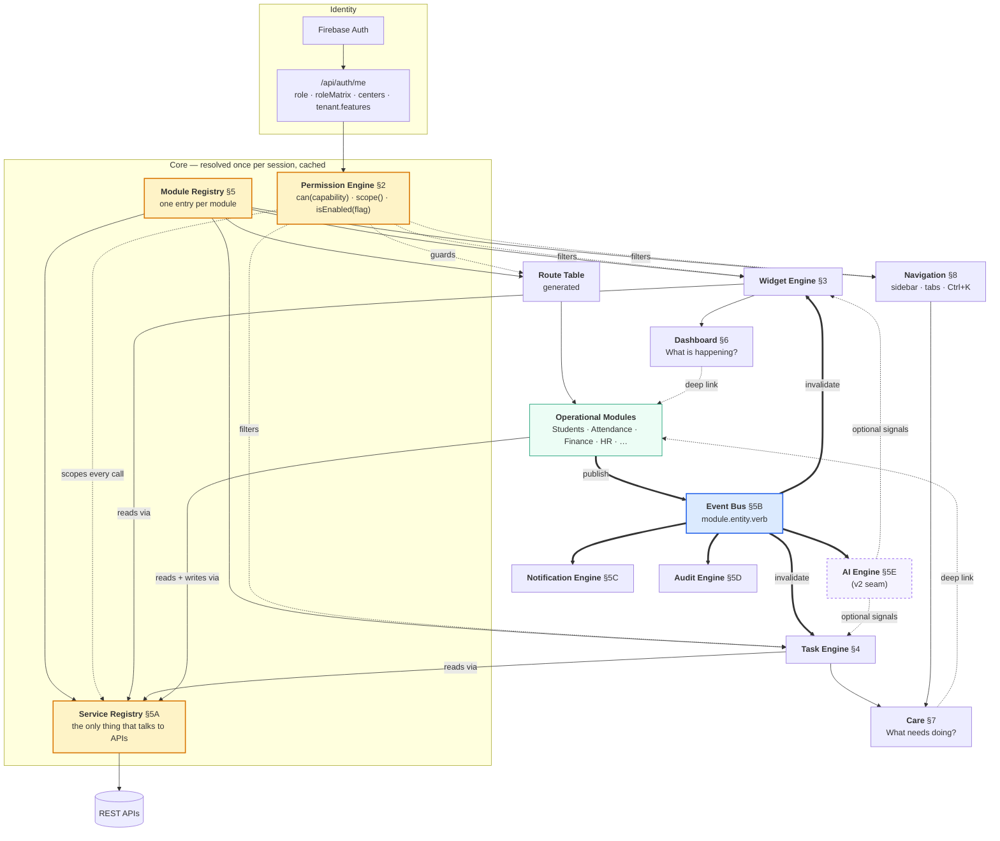
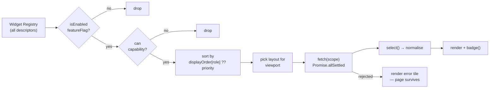
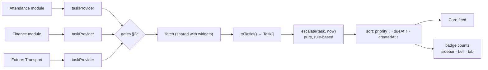
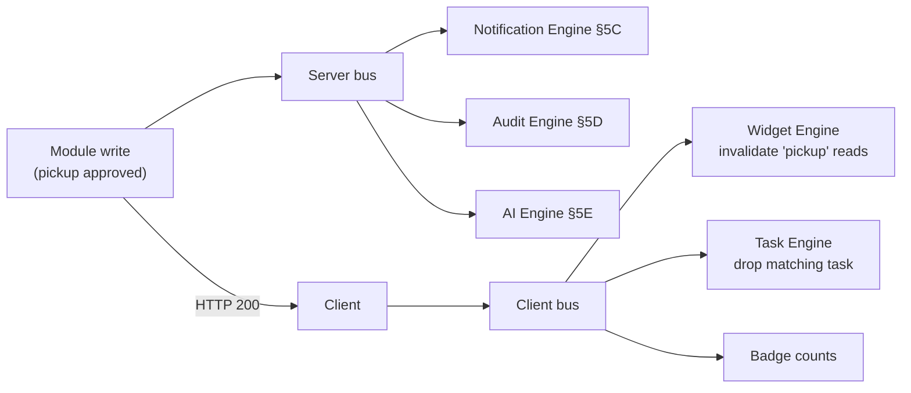
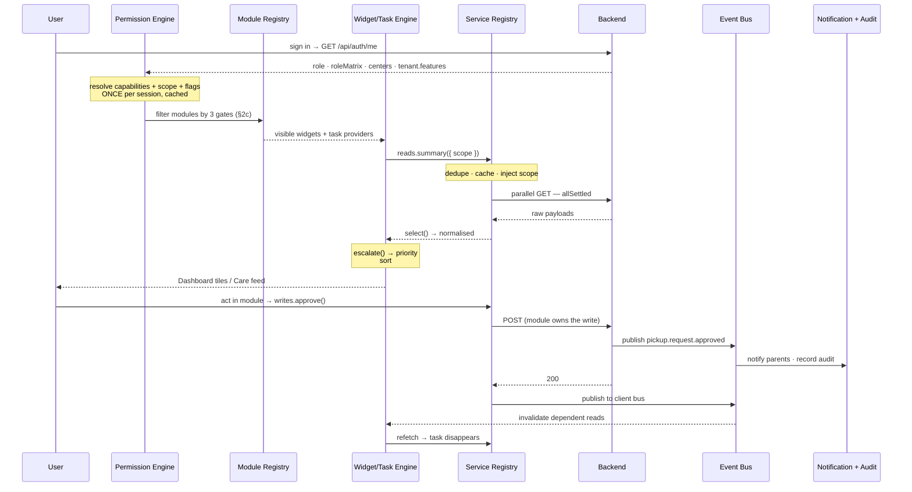

# KUE BOXS Care — Platform Architecture

**Status: 🔒 FROZEN — v1.0. This is the foundation architecture for KUE BOXS Care.**
**Approved:** 2026-07-25. Changes to §1–§5E require an explicit revision entry below, not a silent edit.
**Date:** 2026-07-25 (frozen with refinements R1–R5 incorporated)

### Revision log

| Rev | Date | Change |
|---|---|---|
| 1.1 | 2026-07-26 | **§2c amended — capability scope levels `self` / `team` / `all`.** Driven by Phase 1's finding that the HR suite is unreachable: the obvious fix (grant `staff-payroll` to `teacher`) would hand every teacher the whole payroll module, when what is intended is "a teacher may see *their own* payslip." A binary capability cannot express that. Access to HR, Payroll and Performance is **blocked pending this model** — see §2c.1 and `PHASE1_ACCESS_DIFF.md`. No other section changes. |
| 1.0 | 2026-07-25 | Approved. Five refinements incorporated: **R1** Service Registry (§5A) — widgets and task providers consume services, never `api` directly. **R2** Event Bus (§5B) — modules publish events; Dashboard, Care, notifications and audit react without coupling. **R3** AI promoted to a platform-level AI Engine (§5E), not a widget. **R4** Notification (§5C) and Audit (§5D) Engines — modules never notify or write audit rows directly. **R5** Per-user widget customization confirmed **out of v1**; role-based layouts only (closes open question 5). |

**Interpretation of the approval:** the four remaining open questions from v0 are treated as **accepted as recommended** — capability format `module.action` (Q1), shared FE/BE registry artifact with a CI drift check (Q2), route `/dashboard` (Q3), and branch-level scope in v1 with class-level deferred (Q4). Each is flagged at its point of use; say the word on any and it changes before that phase ships.

**Supersedes:** the *structure* proposed in [ACTION_CENTER_ARCHITECTURE_PLAN.md](../control-center-redesign/ACTION_CENTER_ARCHITECTURE_PLAN.md) and [CONTROL_CENTER_DASHBOARD_PLAN.md](../control-center-redesign/CONTROL_CENTER_DASHBOARD_PLAN.md). Their *content* — the Task engine design (§3 of the former), the per-role KPI matrix, and the endpoint-by-endpoint API mapping — is carried forward here intact and cross-referenced, not rewritten.
**Ground truth:** [BACKEND_CAPABILITY_AUDIT.md](../engineering-audit/BACKEND_CAPABILITY_AUDIT.md), plus direct reading of `yellowdot-frontend/src` and `yellowdot-backend` on 2026-07-25. Every claim about current behaviour in §0 cites a file and line.

---

## §0. What already exists — read this before anything else

The brief asks for a permission-driven, registration-based platform. **Most of that substrate is already built and shipped.** The single most important finding of this pass:

> **The Permission Engine you are asking for already exists, end to end, in production — and is used by 8 screens out of ~100.** This work is *completion and adoption*, not invention. Building a new one would be the third parallel permission system in this codebase.

### 0.1 The granular permission engine that already ships

There is a complete `module.action` capability system running today:

| Layer | File | What it does |
|---|---|---|
| Storage | Firestore `roles` collection | Per-school role docs with `permissions: { moduleId: { action: bool } }` — **custom roles already supported** |
| Resolution | `yellowdot-backend/services/roleService.js:216` | `getRoleMatrix(roleId, schoolId)` → the matrix, 60 s in-process cache |
| Transport | `yellowdot-backend/routes/authRoutes.js:75` | `/api/auth/me` returns `roleMatrix` alongside `permissions` |
| Client state | `yellowdot-frontend/src/contexts/AuthContext.jsx:55` | `roleMatrix` held in context, refreshed by `refreshPermissions()` |
| Check | `AuthContext.jsx:249` | `canDo(moduleId, action)` — **this is literally `canViewAttendance`**, spelled `canDo("attendance", "view")` |
| Admin UI | `pages/RolesPermissions.jsx` | Full matrix editor, role templates, risk levels, dependency rules (`rbacConfig.js:29`) |

`canDo` is consumed by exactly 8 files today — `Attendance.jsx:1188`, `Invoice.jsx:1264`, `Students/index.jsx:43`, `PickupAuthorization.jsx:439`, `FoodMenu.jsx:210`, `NapTracker.jsx:340`, `Fees.jsx:55`, `Settings.jsx:1452` — and by `QuickActionCard`, which already accepts a declarative `permission: { moduleId, action }` prop and **renders `null` when the check fails** (`components/ui/QuickActionCard/index.jsx:38-46`). That component is a working proof of the widget contract this brief asks for.

### 0.2 The registry pattern that already exists — four times over

The brief's "register a module, get everything for free" goal is partially realised, but **the same module must currently be registered in four to six separate places**:

| Registry | File | Entries | Consumed by |
|---|---|---|---|
| Routes | `App.jsx` | ~106 `path=` declarations in one 881-line file | React Router |
| Sidebar tree | `config/sidebarConfig.js` | 77 items with `routeKey` | Sidebar nav |
| Module grid | `pages/quickNavigation/modules.js` | 34 items with `routeKey` | Control Center grid, Ctrl+K search |
| Permission matrix | `config/rbacConfig.js:67` | 27 modules | Roles & Permissions UI |
| Route derivation (FE) | `config/rbacConfig.js:163` `MODULE_ROUTE_MAP` | 25 mappings | Sidebar preview in Roles UI |
| Route derivation (BE) | `services/roleService.js:103` `MODULE_ROUTE_MAP` | duplicate of the above | Actual permission resolution |

**This is the real scalability problem** — not the Dashboard layout. Adding Transport today means six edits in five files across two repos, with two of them (the `MODULE_ROUTE_MAP` pair) being hand-maintained duplicates that must not drift.

### 0.3 Four concrete gaps this creates today (verified, not hypothetical)

1. **Permissions that map to nothing.** `MODULE_ROUTE_MAP` has `medical: []`, `notifications: []`, `documents: []` (`rbacConfig.js:170,184,186`). Granting "Medical Records → view" in the Roles UI grants access to zero routes. The switch is real; the wiring is not.
2. **The entire Finance Platform is invisible to the matrix.** The 11 `FINANCE_*` route keys (`permissions.js:88-104`) appear in no `PERMISSION_CATEGORIES` module and no `MODULE_ROUTE_MAP` entry. Finance access survives only through the `STATIC_ROLE_PERMS` baseline union at `roleService.js:172`. **A school cannot restrict Finance per-role through the Roles UI** — the granular system cannot express it.
3. **Feature flags are build-time constants, not tenant configuration.** `config/featureFlags.js` resolves flags from `isPreProduction` at build time; the backend gates Finance on `process.env.FINANCE_FOUNDATION_ENABLED` (`middleware/financeFoundationFlag.js:15`). There is **no per-tenant feature flag storage** — `tenants` docs carry `subscriptionPlan` and `status` but no `features` map. Two tenants on the same deployment cannot have different modules enabled.
4. **Branch exists as data but is not a permission input.** `tenants.branches[]` exists (`tenantService.js:17,205`) and sessions carry `centerId`/`centers[]` (`authMiddleware.js:68`), but no permission check consults either. Scope is enforced ad hoc inside individual services (e.g. `cctvAccessResolver.js`), not by a shared rule.

Also relevant to §6/§12: **`LIVE_DASHBOARD` is `isPreProduction`** (`featureFlags.js:44`) — the Dashboard route the prior plan makes the universal landing page is currently disabled in production.

### 0.4 The legitimate role checks (there are only three)

The brief says never check role names. Three current checks are defensible and should be *encapsulated*, not eliminated:

- `isBypassRole()` (`permissions.js:27`) — `developer`/`super_admin` wildcard. Keep, but express as a capability grant (`*`) resolved inside the engine, so no call site ever names a role.
- `ROLE_HOME` (`permissions.js:223`) — per-role landing route. **This is a genuine violation** and is superseded: Dashboard is the universal landing page (Round 9 decision), so this table reduces to `parent` vs everyone else.
- `AuthContext.jsx:132-151` — a stale-permission auto-refresh keyed on `ADMIN_ROLES`. A migration workaround; delete once §12 Phase 1 lands.

---

## §1. Platform architecture diagram

The brief's stack is correct in sequence but slightly incomplete in shape: the Permission Engine is not just an upstream stage, it is a **service every downstream layer queries**, and the Module Registry feeds the Widget and Task engines rather than sitting after them.



**The five invariants that make this an architecture rather than a diagram:**

1. **Every surface is a projection of the Module Registry, filtered by the Permission Engine.** Dashboard, Care, sidebar, command palette, and the route table are five *views* of one dataset. None holds its own list of modules.
2. **Dashboard and Care never mutate.** They read, count, and link. All writes happen inside the owning module. This is what prevents business logic from being duplicated into the shell — inherited from the Round 5 decision that Care "reads, links, and counts; it never mutates."
3. **Nothing calls an API except a registered service.** Widgets, task providers, and pages consume services (§5A). `api.get` outside `services/` is a lint error.
4. **Modules publish events; they never call another module.** Notification, audit, cache invalidation, and AI are all *subscribers* (§5B). A module that imports another module's service is a coupling bug.
5. **Cross-cutting concerns are engines, not calls.** Notifications (§5C) and audit (§5D) happen because an event was published, not because a developer remembered to call them.

---

## §2. Permission Engine design

### 2a. The capability model

**Canonical capability string: `<module>.<action>`** — `attendance.view`, `attendance.edit`, `finance.invoices.approve`.

This is not a new format. It is the existing `roleMatrix` shape (`{ attendance: { view: true } }`) addressed as a flat string. Storage, the Roles UI, the Firestore documents, and the backend resolver all stay exactly as they are.

**Why `module.action` rather than the brief's `canViewAttendance`:**

| | `canViewAttendance` | `attendance.view` |
|---|---|---|
| Matches shipped Firestore data | ✗ needs migration | ✓ already the storage format |
| Enumerable (list all actions on a module) | ✗ string parsing | ✓ trivial |
| Roles UI can render it as a grid | ✗ | ✓ already does |
| New action needs code change | ✓ new constant | ✗ data only |

`canViewAttendance` and `attendance.view` are the same concept; the second is the addressable form of the first. **The brief's actual requirement — "the UI must never check role names directly" — is fully satisfied either way**, and the `module.action` form is satisfied without a data migration. If a readable alias is wanted at call sites, `usePermissions()` can expose a proxy (`p.attendance.view`) as sugar over the same lookup.

### 2b. One API, replacing two

Today: `can(routeKey)` (route-level) and `canDo(moduleId, action)` (action-level) are parallel systems with independent failure modes.

Target: **one function.**

```js
const { can, level, scope, isEnabled } = usePermissions();

can("attendance.view")                 // capability → boolean (level !== "none")
can("attendance.*")                    // any action on the module
can(["fees.view", "invoices.view"])    // any-of

level("staff_payroll.view")            // "none" | "self" | "team" | "all"  (rev 1.1, §2c.1)
can("staff_payroll.view", "team")      // true only at "team" OR "all" — levels are ordered
```

`can()` stays boolean so existing call sites are unaffected; `level()` is the new capability for screens that must render differently for self vs team vs all. Levels are ordered `none < self < team < all`, so a `"team"` requirement is satisfied by `"all"`.

Migration is non-breaking because the two namespaces are distinguishable: a capability contains a dot, a legacy route key does not. `can()` routes bare strings to the legacy list during Phase 1–3 of §12 and logs a deprecation warning in dev builds, so the 18 files using `can(routeKey)` keep working untouched while they are converted.

### 2c.1 Capability scope levels — `self` / `team` / `all` *(rev 1.1)*

**A capability is not a boolean. It is a level.**

Phase 1 found the HR suite unreachable for every non-bypass role. The mechanical fix — grant `staff-payroll` to `teacher`, as two of the three existing role maps already say — is wrong, because that key is all-or-nothing: it would give every teacher the payroll module for the whole school when the intent is "a teacher may open *their own* payslip." The same is true of leave (mine vs my reports' vs everyone's) and performance reviews.

So the matrix value changes from a boolean to a level:

```js
// before                          // after
{ staff_payroll: { view: true } }  { staff_payroll: { view: "all" } }
```

| Level | Means | Resolves through |
|---|---|---|
| `none` | No access. Equivalent to the old `false`. | — |
| `self` | Only rows about **me**. | `user.userId` / the caller's own staff record |
| `team` | Rows about **my direct reports**, plus my own. | `staff.reportingManagerId` — *already exists*, confirmed in the Backend Capability Audit |
| `all` | Every row in scope. Equivalent to the old `true`. | bounded by the branch/class gate below |

**Backward compatible by construction:** `true` → `all`, `false` → `none`. Every existing role document keeps its exact current meaning with no migration, and `canDo(m, a)` keeps returning a boolean (`level !== "none"`), so the eight screens using it today are unaffected.

**This is a different axis from the branch/class gate.** They compose, and conflating them is the mistake to avoid:

- **Scope level** answers *whose* records — mine, my team's, everyone's.
- **Data scope** (gate 3 below) answers *where* — which branch, which class.

A principal with `staff_leave.approve: "team"` in branch `seawoods` sees leave requests from their direct reports at Seawoods — the intersection, never the union.

**Worked example — what the HR keys should actually grant:**

| Role | `staff_payroll.view` | `staff_leave.view` | `staff_leave.approve` | `staff_performance.view` |
|---|---|---|---|---|
| Teacher | `self` | `self` | `none` | `self` |
| Principal / Center Admin | `team` | `team` | `team` | `team` |
| Center Owner | `all` | `all` | `all` | `all` |
| Accountant | `none` | `none` | `none` | `none` |

Compare with what the current maps would have granted a teacher: `all`, on every column. That gap is precisely why the access-widening diff is held for review rather than applied.

**Enforcement is server-side, always.** The level travels in `roleMatrix`, and the frontend uses it to choose what to render and which query to issue — but the API must independently resolve `self`/`team` from the authenticated user, never from a client-supplied parameter. A `self`-scoped client asking for someone else's payslip must get a 403 from the server, not merely an absent button. This is the same boundary as §10's security note, and it is why the HR access change waits for the model rather than shipping on frontend gating alone.

**Cost, stated honestly:** every HR endpoint that today returns "all rows for the school" needs a scope-aware `WHERE`. That is real backend work — the reason this is a prerequisite for the HR access change rather than something bolted on afterwards. Modules with no self/team distinction (Attendance, Finance, Communication) simply declare `all` and are unaffected.

### 2c. The three-gate resolution — permission is necessary, not sufficient

Visibility of anything (widget, task, nav item, route) is the **conjunction of three independent gates**, evaluated in this order:

```
visible = isEnabled(module.flag)        // 1. does this tenant have the feature at all?
       && can(module.capability)         // 2. does this role have the capability?
       && inScope(user.scope, resource)  // 3. is this row within the user's branch/class?
```

Collapsing these is the mistake to avoid. They answer different questions, fail differently, and are owned by different people:

| Gate | Question | Owner | Storage | Failure mode |
|---|---|---|---|---|
| **Feature flag** | Is this module sold/enabled for this tenant? | Platform / Super Admin | `tenants/{id}.features` *(to build — §0.3 gap 3)* | Module absent entirely, no error |
| **Capability** | May this role do this? | School admin, via Roles UI | `roles/{id}.permissions` *(exists)* | UI element absent; API returns 403 |
| **Scope** | Over which rows? | Derived from assignment | `user.centers[]`, class allocations *(data exists, §0.3 gap 4)* | Query filtered; cross-scope access 403 |

**Scope is a first-class object, not a permission:**

```js
scope = {
  tenantId:  "kueboxs",
  schoolId:  "ydseawoods",
  branchIds: ["seawoods"],        // from user.centers[] — today's centerId
  classIds:  ["butterfly-room"],  // from teacher allocation; [] = all in branch
  self:      "staff_1042",        // for self-service views (own leave, own payslip)
}
```

Widgets and task providers receive `scope` and **must** parameterise their fetches with it. A widget that ignores scope is a bug, not a feature — but the backend remains the enforcement point (this is why §12 pairs every frontend phase with backend verification, and why the Backend Capability Audit's IDOR findings remain open work independent of this refactor).

### 2d. Bypass, without naming roles

`isBypassRole()` stays as an implementation detail *inside* the engine. `getRoleMatrix` already returns `{ _bypass: true }` for developer/super_admin (`roleService.js:217`); the engine reads that flag. **No call site ever sees a role name.** A future role gains platform access by receiving `_bypass` or a `*` grant in its role document — zero UI code changes, which is precisely the brief's test.

### 2e. What must be built

| Work | Type | Notes |
|---|---|---|
| `usePermissions()` hook wrapping the three gates | New, small | Thin layer over existing `roleMatrix` |
| `can()` accepting capability strings, with legacy fallback | Extend `AuthContext` | Non-breaking |
| Complete `PERMISSION_CATEGORIES` — add Finance Platform, Incidents, Communication, Child Journey, HR, Tenants | **Data** | Closes §0.3 gap 2 |
| Fill the empty `MODULE_ROUTE_MAP` entries | **Data** | Closes §0.3 gap 1 |
| Derive `MODULE_ROUTE_MAP` from the Module Registry instead of hand-maintaining it twice | Refactor | Removes FE/BE drift risk |
| `tenants/{id}.features` + `isEnabled()` reading it | **New — backend** | Closes §0.3 gap 3; the only genuinely new backend work in this plan |
| `scope` resolution in `/api/auth/me` | Extend | Fields exist; assembling them is new |

---

## §3. Widget Engine design

### 3a. Widget descriptor

Every widget is a data declaration. The fields below are the brief's list, with types, plus three additions marked ⊕ that the current codebase proves are needed.

```js
{
  id:            "attendance-today",
  title:         "Attendance",
  icon:          CalendarCheck,              // lucide component
  description:   "Today's presence at a glance",

  capability:    "attendance.view",          // §2b — single capability or any-of array
  featureFlag:   "ATTENDANCE",               // §2c gate 1
  moduleId:      "attendance",               // ⊕ links to Module Registry (§5)

  priority:      20,                         // sort weight, lower = higher on page
  displayOrder:  { teacher: 10, accountant: 90 },  // optional per-role override of priority

  refreshInterval: 60_000,                   // ms; null = fetch once on mount
  destination:   "/attendance",              // deep link — the widget's "Open →"

  layouts:       ["stat", "chart", "list"],  // which forms this widget supports
  defaultLayout: { mobile: "stat", desktop: "chart" },

  badge:         (data) => data.absent > 0 ? { count: data.absent, tone: "warn" } : null,
  quickActions:  [{ label: "Mark attendance", capability: "attendance.mark", to: "/attendance" }],

  fetch:         ({ scope, signal }) => api.get(`/api/attendance/summary?date=…&branch=${scope.branchIds}`),
  select:        (raw) => ({ present: …, absent: …, pct: … }),   // ⊕ normalise API shape
  emptyState:    "No students enrolled yet",                      // ⊕ per-widget, not generic
}
```

**Why the three additions:**
- `moduleId` — without it, a widget and its module are two unrelated records and the registry cannot answer "what does Transport contribute?"
- `select` — the existing APIs return inconsistent shapes (`useDashboardStats.js:44-50` already unwraps three different response envelopes). Normalising in the descriptor keeps that mess out of the renderer.
- `emptyState` — the prior plan committed to "one calm, specific message, not a generic no-data box." That copy has to live somewhere; the descriptor is that place.

### 3b. Resolution pipeline



**Rules the engine enforces so widgets don't have to:**

- **Failure is per-widget.** `Promise.allSettled`, the pattern `useDashboardStats.js:37` already uses. One dead endpoint degrades one tile; the Dashboard still renders. This is the same resilience discipline as the Finance graceful-degradation work already shipped.
- **One fetch per widget per interval**, deduplicated by `id`. Two widgets needing the same endpoint declare a shared `fetch` key rather than double-calling.
- **Refresh pauses when the tab is hidden** and refetches on focus — the freshness rule from the prior plan §3f, implemented once in the engine.
- **The engine never knows what a widget means.** No `switch (widget.id)` anywhere. If that statement stops being true, the abstraction has failed.

### 3c. Layouts

`stat` (single number + delta), `chart` (trend), `list` (top-N rows), `meter` (progress toward target). A widget declares which it supports; the engine picks per viewport. A widget supporting only `stat` renders as `stat` everywhere — no fallback logic in the widget.

**Widgets are not user-arrangeable — decided, not deferred pending discussion (R5).** Order is `displayOrder[role] ?? priority`; **role-based layouts are the model.** Per-user drag-and-drop persistence is explicitly out of v1: it needs a storage model, a reset story, and a support answer for "my dashboard looks wrong," and it undercuts the product thesis that the platform decides what matters. The descriptor's `priority`/`displayOrder` split remains the seam should it ever be revisited — no code is written for it now.

---

## §4. Task Engine design

**The Task Engine is already specified.** [ACTION_CENTER_ARCHITECTURE_PLAN.md §3](../control-center-redesign/ACTION_CENTER_ARCHITECTURE_PLAN.md) defines the `Task` schema (§3a), the rule-based escalation ladder (§3b), derived status (§3c), role/scope ownership (§3d), presentation (§3e), and freshness (§3f). **That design is carried forward unchanged and is not restated here.**

Three reconciliations this architecture makes to it:

**1. Task providers are part of module registration, not a separate registry.** The prior plan proposed a standalone `careProviders.js`. Under §5 a module declares its task provider inline, so `provider.routeKey` becomes `provider.capability` and inherits the module's gates automatically. One registration, not two.

**2. `Task.domain` becomes `moduleId`.** The prior plan's seven-value `domain` enum (`classroom`/`finance`/`admissions`/`staff`/`communication`/`academics`/`platform`) is a hand-maintained list that must grow every time a module category appears — exactly the coupling this refactor removes. Filter chips derive from the `category` of the contributing modules instead. The `"care" → "classroom"` rename decided in Round 8 is thereby moot: the collision disappears because the enum does.

**3. Task providers and widgets share their fetch.** A module's "3 pickups pending" widget badge and its three pickup Tasks come from one request, deduplicated by the engine (§3b). Without this, Dashboard and Care double every API call.



The engine core stays two pure functions — `escalate(task, now)` and the sort comparator. Everything else is provider-contributed.

---

## §5. Module Registry specification

**One entry per module. Every other list in the app is derived from it.**

```js
{
  id:          "attendance",
  label:       "Attendance",
  icon:        CalendarCheck,
  category:    "daily_ops",              // groups sidebar + Care grid + filter chips

  // ── Gates (§2c) ──────────────────────────────────────────────────────
  capability:  "attendance.view",        // minimum to see the module at all
  featureFlag: "ATTENDANCE",

  // ── Routing — replaces hand-written <Route> blocks ───────────────────
  routes: [
    { path: "/attendance",     component: Attendance,    capability: "attendance.view" },
    { path: "/child-presence", component: GateRegister,  capability: "attendance.view", label: "Gate Register" },
  ],

  // ── Actions this module defines (feeds the Roles UI grid) ────────────
  actions: ["view", "mark", "edit", "export"],

  // ── Discovery ────────────────────────────────────────────────────────
  keywords: ["attendance", "present", "absent", "roll call", "check in"],

  // ── Service — the module's only API surface (§5A) ────────────────────
  service:     attendanceService,

  // ── Events this module publishes (§5B) — the enumerable catalogue ────
  events: [
    { type: "attendance.record.marked",   audit: true },
    { type: "attendance.record.corrected", audit: "required" },
  ],
  notifications: attendanceNotifications,          // §5C declarations

  // ── Contributions — all optional; a module may contribute none ───────
  widgets:      [attendanceTodayWidget],          // §3
  taskProvider: attendanceTaskProvider,           // §4
  quickActions: [{ label: "Mark attendance", capability: "attendance.mark", to: "/attendance" }],
  badge:        ({ services, scope }) => services.get("attendance").reads.pending({ scope }),
  aiCapabilities: [],                             // §5E — none in v1

  // ── Surface placement ────────────────────────────────────────────────
  surfaces: {
    sidebar: { group: "attendance", order: 10 },
    care:    { roles: ["teacher", "reception"], order: 20 },  // destination-grid membership
    mobile:  true,
  },
}
```

### 5a. What the registry replaces

| Today | After |
|---|---|
| `App.jsx` — ~106 hand-written routes | Generated from `modules[].routes` |
| `sidebarConfig.js` — 77 items | Derived via `surfaces.sidebar` |
| `quickNavigation/modules.js` — 34 items | Derived; Care destination grid via `surfaces.care` |
| `rbacConfig.PERMISSION_CATEGORIES` — 27 modules | Derived from `id` + `actions` + `category` |
| `MODULE_ROUTE_MAP` ×2 (FE + BE) | Derived from `routes[].capability` — **the duplication disappears** |
| Ctrl+K palette index | Derived from `label` + `keywords` |

`ACCENT` colours (`modules.js:34`) move onto the `category` definition rather than being repeated per module.

### 5b. The registry is shared, not frontend-only

`MODULE_ROUTE_MAP` exists in both repos and must agree. The registry's **capability and route data** should be a shared JSON artifact consumed by both — a small `platform-registry` package, or a generated file checked into both repos with a CI drift check. Component references and icons stay frontend-only. Without this, §0.3 gap 1 recurs the first time someone edits one copy.

### 5c. Adding a module — the acceptance test for this whole architecture

Adding Transport must be **exactly**: create the module folder, add one registry entry, add its actions to the role documents that should have it. That is the test. If a future module requires touching Dashboard, Care, navigation, or the route table, this architecture has failed and should be fixed rather than worked around.

---

## §5A. Service Registry *(R1)*

**Rule: widgets, task providers, and pages never call `api.*` directly. They consume a registered service.**

### 5A.1 This is formalisation, not new construction

`yellowdot-frontend/src/services/` already holds **37 service modules** (`attendanceService.js`, `incidentService.js`, `financeService.js`, …). The layer exists; what's missing is that it is *bypassed*. `useDashboardStats.js:37-42` calls `api.get("/students")`, `api.get("/api/attendance/summary?…")` and two more directly, rather than going through `studentService`/`attendanceService`. So the same endpoint gets called with different shapes, different error handling, and different response unwrapping in different places.

*(Noted while auditing: `services/studentService.js` is **0 bytes** — an empty file that exists but exports nothing. Anything needing student reads today has no service to use, which is part of why the direct-`api` habit formed. Phase 1 of §12 fills it.)*

### 5A.2 Service contract

```js
// modules/attendance/service.js
export default defineService({
  id: "attendance",
  capability: "attendance.view",        // baseline; per-method overrides allowed

  reads: {
    summary:  ({ scope, date, signal }) => api.get(`/api/attendance/summary?date=${date}&branch=${scope.branchIds}`),
    pending:  ({ scope, signal })       => api.get(`/api/attendance/pending?branch=${scope.branchIds}`),
  },

  writes: {
    mark: {
      capability: "attendance.mark",     // stricter than the service baseline
      fn:      ({ studentId, status }) => api.post("/api/attendance/mark", { studentId, status }),
      emits:   ({ studentId }) => ({ type: "attendance.record.marked", payload: { studentId } }),  // §5B
    },
  },

  select: { summary: (raw) => ({ present: raw.summary?.present ?? 0, … }) },  // one normalisation, everywhere
});
```

**What the registry provides so services don't reimplement it:**

| Provided | Why it belongs here, not in 37 services |
|---|---|
| **Scope injection** | Every read receives `scope` (§2c). A service that ignores it is caught in review, not in production. |
| **Request dedup** | Dashboard widget + Care task provider needing the same read = one HTTP call. Solves §3b/§4 double-fetch. |
| **Short-TTL cache + invalidation** | Keyed by service+method+args; cleared by event subscription (§5B) rather than timers. |
| **Uniform errors** | One `ServiceError { status, code, message, retriable }`. Removes the three-different-envelope unwrapping in `useDashboardStats.js:44-50`. |
| **Capability pre-check** | A write whose capability fails throws before the request. Convenience only — **the backend is still the enforcement point.** |
| **`AbortSignal` plumbing** | Unmounting a widget cancels its inflight reads. |

### 5A.3 Registration and access

A service is registered by its module entry (`service: attendanceService` in §5). Consumers resolve it by id — `useService("attendance")` — never by import path. This is what makes the boundary enforceable: a module importing `../finance/service` is an obvious violation, whereas `useService("finance")` is a legitimate cross-module *read* mediated by capability checks.

**Enforcement:** an ESLint rule banning `services/api` imports outside `services/` and `modules/*/service.js`. Without a lint rule this convention decays within a quarter — that is what happened to the existing service layer.

---

## §5B. Event Bus *(R2)*

**Rule: modules publish facts about what happened. They never call another module, and they never tell a surface to refresh.**

### 5B.1 Two buses, deliberately

| | Client bus | Server bus |
|---|---|---|
| Implementation | Tiny in-memory pub/sub in `AppShell` | Node `EventEmitter` in-process |
| Publishers | Module UI after a successful write | Services after a successful commit |
| Subscribers | Widget Engine, Task Engine, badge counts, toasts | Notification Engine (§5C), Audit Engine (§5D), AI Engine (§5E) |
| Guarantee | Best-effort, same tab | At-least-once *within the request*; see 5B.4 |

**Explicitly NOT proposed: distributed pub/sub infrastructure** (Pub/Sub, Kafka, a queue). This app is a single Node process serving one deployment. An in-process emitter delivers the decoupling with none of the operational cost. If horizontal scaling arrives, §5B.4's outbox is the upgrade path — designed for, not built now.

### 5B.2 Event shape

```js
{
  type:      "pickup.request.approved",   // <module>.<entity>.<pastTenseVerb> — always past tense
  payload:   { requestId, studentId, approvedBy },
  scope:     { tenantId, schoolId, branchId },
  actor:     { userId, email, role },
  occurredAt:"2026-07-25T11:04:12.881Z",
  eventId:   "evt_01J…",                  // idempotency key for subscribers
}
```

Past tense is not a style preference: it enforces that an event is a **record of something that already committed**, not a command. `pickup.request.approve` would be a disguised function call and reintroduces the coupling this removes.

**Events are declared in the module registry** (`events: ["pickup.request.approved", …]`), so the full catalogue is enumerable, documentable, and testable — no grepping for string literals.

### 5B.3 What subscribes to what



This replaces §9's "returning from a deep link invalidates" heuristic with something precise: a pickup approval invalidates exactly the reads that depend on pickups, immediately, whether or not the user navigated back.

### 5B.4 Failure semantics — the part that matters

- **Subscribers never break publishers.** Each subscriber runs in its own `try/catch`; a thrown error is logged and swallowed. Approving a pickup must not fail because a push notification failed. This is the existing `notif.notifyAsync()` fire-and-forget discipline (`careController.js:47`), generalised.
- **Audit is the exception** (§5D.3) — it must not be silently droppable.
- **Subscribers must be idempotent**, keyed on `eventId`. Re-delivery is possible during retries.
- **Ordering is not guaranteed** across event types. A subscriber needing ordering must read current state, not infer it from event sequence.

---

## §5C. Notification Engine *(R4)*

**Rule: modules never call `notificationService`. They publish an event; notification is a subscriber.**

### 5C.1 What exists, and what's actually wrong

`yellowdot-backend/services/notificationService.js` is **good** and stays: a `TYPES` enum (~25 types), `PRIORITY` levels, `TYPE_META` priority mapping, `fireForStudent()` fan-out to a student's parents, and `notifyAsync()` fire-and-forget. None of that is the problem.

The problem is **16 files invoke it imperatively, inline, interleaved with business logic** — `careController.js`, `attendanceController.js`, `napController.js`, `foodConsumptionController.js`, `securityController.js`, `incidentService.js`, `milestoneService.js`, plus 7 route files. Consequences:

- Notification copy is embedded in controllers (`careController.js:47-56` builds title, message, emoji and deep link inside a care-log handler).
- Adding a channel (SMS, WhatsApp — `whatsappService.js` exists but is separately wired) means editing all 16.
- No single place answers "what notifications does this platform send?"
- Recipient rules are re-derived per call site.

### 5C.2 The engine

```js
// modules/pickup/notifications.js — declared next to the module, registered by it
defineNotifications({
  "pickup.request.approved": {
    type:       NOTIF.PICKUP_APPROVED,
    audience:   ({ payload }) => ({ parentsOf: payload.studentId }),
    channels:   ["push", "inApp"],
    title:      ({ student }) => `${student.name} — pickup approved`,
    body:       ({ student, approver }) => `${student.name}'s pickup was approved by ${approver.name}.`,
    deepLink:   "/parent-pickup",
    dedupeKey:  ({ payload }) => `pickup:${payload.requestId}`,
  },
});
```

The engine owns: audience resolution, channel fan-out, quiet hours, per-user preferences, dedup, delivery logging, and retries. Modules own only *what to say*.

### 5C.3 Boundaries worth stating

- **Notifications are not Tasks.** A notification is a push at a moment; a Task (§4) is state that persists until resolved. An event may produce both, one, or neither — a pickup approval creates a parent notification and *removes* a staff task.
- **Parent-facing and staff-facing notifications share the engine, not the rules.** Audience resolution differs entirely.
- **Migration is per-module and reversible.** Each of the 16 call sites converts independently: publish the event, register the declaration, delete the inline call. The two mechanisms coexist during migration — verified by asserting notification counts are unchanged before/after per module.

---

## §5D. Audit Engine *(R4)*

**Rule: modules never write audit rows. Audit is an event subscriber.**

### 5D.1 Audit is genuinely fragmented today — three shapes, three collections

| Implementation | File | Shape |
|---|---|---|
| Finance audit | `services/financeAuditService.js:25` | `{ schoolId, actorUserId, action, entityType, entityId, meta }` |
| Tenant audit | `services/tenantService.js:56` | `{ tenantId, action, actorUserId, actorEmail, meta, createdAt }` |
| Ad hoc | `incidentService.js`, `pickupAuthorizationService.js`, `authRoutes.js` | inline, per-site |

Two different actor fields, two different scope fields, two different collections, no shared query surface. **There is no way to answer "what did this user do yesterday?" across modules** — which is the entire point of an audit log.

### 5D.2 Canonical record

```js
{
  eventId, type: "pickup.request.approved",
  actor:    { userId, email, role },
  scope:    { tenantId, schoolId, branchId },
  entity:   { type: "pickupRequest", id: "REQ123" },
  before:   { status: "pending" },     // omitted for creates
  after:    { status: "approved" },    // omitted for deletes
  meta:     { reason: "…" },
  occurredAt, recordedAt,
}
```

Derived automatically from the §5B event — a module that publishes correctly gets audit for free. A registry flag (`audit: true|false|"redact"`) marks which events are auditable and which fields to redact.

### 5D.3 Audit has stricter delivery than notifications

Notifications are fire-and-forget; **audit is not**. For events flagged `audit: "required"` (financial transactions, permission changes, data deletion, refund approvals), the write is awaited and a failure is escalated — logged at error level with an alert, never silently swallowed. This is the one place §5B.4's "subscribers never break publishers" is deliberately relaxed, and it is a compliance requirement, not a preference.

### 5D.4 Migration must not break the Finance Audit screen

A Finance Audit UI already reads `financeAuditService.listForEntity/listForSchool`. The engine therefore ships as **write-through first**: the new engine writes the canonical record *and* the legacy finance collection continues to be written, so existing readers are untouched. Legacy writes are removed only after the Finance Audit screen is repointed at the unified query. **Do not migrate the reads and the writes in the same commit.**

---

## §5E. AI Engine *(R3)*

**Promoted from a widget to a platform capability. Not built in v1 — this section defines the seam so that building it later requires no re-architecture.**

### 5E.1 Why not a widget

An "AI Widget" would be a box on the Dashboard that only Dashboard could use. AI is not a place in the UI — it is a capability that several surfaces consume: a summary on Dashboard, a suggested next action in Care, a draft message in Communication, an anomaly flag in Finance. Modelling it as a widget would have forced every other consumer to duplicate the plumbing.

### 5E.2 Shape

```js
defineAICapability({
  id:         "attendance.anomaly",
  moduleId:   "attendance",
  capability: "attendance.view",       // never widens data access — see 5E.4
  featureFlag:"AI_INSIGHTS",
  kind:       "detect",                // summarise | detect | suggest | draft | answer
  inputs:     ({ scope, services }) => services.get("attendance").reads.trend({ scope, days: 30 }),
  render:     { surfaces: ["dashboard", "care"], confidenceFloor: 0.7 },
});
```

Consumers ask the engine (`useAI("attendance.anomaly")`), not a provider. Model choice, prompt construction, token budgets, caching, rate limiting, and fallback live in the engine.

### 5E.3 Rules that protect the rest of the architecture

- **AI never replaces rule-based logic.** Task priority stays the transparent escalation ladder (§3b of the prior plan). An AI signal may *annotate* a task ("similar incidents rose this week"); it may not reorder the queue. A support engineer must always be able to explain why an item is at the top.
- **AI output is always attributed and always dismissible.** Visibly labelled, never rendered as a plain fact.
- **AI is never on the write path.** It cannot approve, send, or post. It may draft; a human commits.
- **Degradation is silent.** Provider down or flag off ⇒ the surface renders without it. No error tiles, no empty AI boxes.

### 5E.4 Data-protection constraint — must be settled before any implementation

This platform holds children's personal data. Any AI capability sending that data to a third-party model provider raises obligations under India's DPDP Act (children's data carries heightened consent requirements), and the tenant — the school — is accountable for them.

Therefore, binding on the engine regardless of provider choice:

- `AI_INSIGHTS` is **per-tenant, default off** (§2c gate 1). Enabling it is a deliberate act by a school, not a deployment default.
- The engine enforces a **PII minimisation boundary**: aggregates and identifiers, not child names, photos, medical notes, or incident narratives, unless a capability explicitly declares and justifies the need.
- Every inference is auditable through §5D (which capability, which tenant, what class of data) without logging the payload itself.
- Provider, data residency, and retention are a **product/legal decision, not an engineering one.** Flagged here for a decision before Phase 8 — not assumed.

---

## §6. Dashboard architecture

**Question answered: "What is happening?"** Insights only. No mutations. Every actionable element deep-links into the owning module.

- **Route:** `/dashboard`. *(The prior plan said `/live-dashboard`; a clean route matching the label is better, with `/live-dashboard` and `/quick-navigation` redirecting.)*
- **Composition:** a header strip (school, branch selector when `scope.branchIds.length > 1`, date) plus the widget grid rendered by the Widget Engine (§3). **Dashboard itself holds no widget list** — it renders whatever the engine resolves.
- **Content is role-aware; structure is not.** Per-role KPI coverage is already specified in [ACTION_CENTER_ARCHITECTURE_PLAN.md §4a](../control-center-redesign/ACTION_CENTER_ARCHITECTURE_PLAN.md) — that matrix becomes the `capability` + `displayOrder` values on each widget descriptor, not a table anyone maintains by hand.
- **The one Care affordance:** a single "needs attention" line surfacing the highest-priority open Task, linking to Care (Round 7/9 decision). One line, not a list — a list would make Dashboard a second Care.
- **Empty is a real state.** A Teacher before school opens sees a calm, specific Dashboard, not skeletons that never resolve.

⚠️ **Blocking dependency:** `LIVE_DASHBOARD` is `isPreProduction` (`featureFlags.js:44`). Dashboard cannot be the universal landing page until that flag is `true` in production. Sequenced in §12 Phase 4.

---

## §7. Care architecture

**Question answered: "What work needs to be done?"** Care is the operational hub — **not** limited to daycare activities (Round 8/9, explicit).

Two stacked regions on one screen, both registry-driven:

```
┌─ Care ─────────────────────────────────────────┐
│  Needs attention                               │
│  ─ Task Engine feed (§4) ─────────────────     │
│  [critical] Incident awaiting acknowledgement  │
│  [critical] Pickup approval — 4:47 PM          │
│  [high]     Attendance not marked — Butterfly  │
│  … one flat priority-sorted list, filter chips │
│                                                │
│  Quick actions                                 │
│  ─ registry quickActions, capability-filtered ─│
│  [Mark attendance] [Record care] [Add student] │
│                                                │
│  Modules                                       │
│  ─ surfaces.care grid, capability-filtered ────│
│  [Attendance] [Daily Care] [Journey] [Pickup]  │
└────────────────────────────────────────────────┘
```

- **The task feed is the Task Engine's output, verbatim** — priority-sorted, no manual re-ordering, domain-as-filter-chips (prior plan §3e).
- **Quick actions** are the union of every visible module's `quickActions`, capability-filtered. Rendered with the existing `QuickActionCard`, which already does its own permission check (§0.1).
- **The module grid** is `surfaces.care` filtered by capability. The per-role content lists the user gave in Round 8 (Teacher: Attendance, Daily Care, Child Journey, Pickup, Incidents, Classroom; Reception: Admissions, Visitors, Attendance, Pickup, Communication; etc.) become `surfaces.care.roles` + `order` values. **These are defaults, not hard-codes** — a school that grants a Teacher Finance access sees Finance appear, because capability is the real gate and the role list only orders what is already permitted.
- **Care never mutates.** A task leaves the feed because its state changed in the owning module. This is the single rule that keeps business logic out of the shell.

---

## §8. Navigation architecture

**Dashboard · Care · Profile.** Same three, same names, mobile and desktop (Round 9, explicit). No "Today", no "Workspace", no "Action Center" — all retired.

| | Mobile | Desktop |
|---|---|---|
| Structure | Bottom tab bar, Care elevated (FAB) | Sidebar: Overview group = Dashboard, Care; module tree below |
| Default landing | Dashboard — **every role, no exceptions** | Dashboard |
| Module access | Care's grid | Sidebar tree + Ctrl+K |
| Search | In Care | Ctrl+K (exists, `Topbar.jsx`) |

The mobile shell reuses `ParentLayout.jsx`'s tab bar (`modules/parent/components/ParentLayout.jsx:44-48` — three tabs, centre tab elevated, exactly this shape). Extract it to a shared `AppShell` taking a tabs array; parent and staff both consume it. **The parent app's Home tab is a retrospective feed — closer to Dashboard than to Care.** Reuse the chrome and card language, not the information model.

`ROLE_HOME` (`permissions.js:223`) collapses to: `parent → /parent-home`, everyone else → `/dashboard`.

**Desktop sidebar stays.** It is already RBAC-filtered and reaches every module; it becomes a derived view of the registry (§5a) rather than a hand-maintained 77-item list. Its `badgeKey` mechanism (`sidebarConfig.js:29`) becomes the registry's `badge` provider.

---

## §9. Data flow



**Six invariants:**

1. **Permissions resolve once per session**, not per render. Already true (`AuthContext`), with `refreshPermissions()` for mid-session role changes.
2. **Reads fan out in parallel and fail independently.** `Promise.allSettled` — one bad endpoint never blanks a page.
3. **Writes never originate in the shell.** Dashboard and Care issue reads only. Grep-able invariant: no `writes.*` call in engine or shell code.
4. **Nothing reaches an API except through the Service Registry** (§5A) — so scope injection, dedup and error normalisation are unavoidable rather than remembered.
5. **Invalidation is event-driven, not navigation-driven** (§5B). The old "refetch when the user returns from a deep link" heuristic is replaced by precise dependency invalidation.
6. **Notification and audit are consequences of the event, not steps in the handler** (§5C/§5D). A module author cannot forget them.

---

## §10. API reuse map

The detailed endpoint-by-endpoint mapping is [ACTION_CENTER_ARCHITECTURE_PLAN.md §5](../control-center-redesign/ACTION_CENTER_ARCHITECTURE_PLAN.md), cross-checked against the Backend Capability Audit. Summary:

### Reused as-is — zero backend work

`GET /api/attendance/summary` · `/api/pickup-requests` · `/api/incidents` + `/api/incidents/dashboard` · `/api/food-consumption` · `/naps/stats/today` · `/api/care/summary` · `/api/finance/invoices` · `/payments` · `/billing-plans` · `/refunds` · `/api/leave-requests` · `/api/staff-attendance/today` · `/api/performance-dashboard` · `/api/announcements` · `/api/notices` · `/students` · `/api/notifications`

`useDashboardStats.js` already composes four of these; widgets follow the same pattern.

### New backend work — three items, in priority order

| # | Work | Why | Blocks |
|---|---|---|---|
| 1 | `tenants/{id}.features` map + `/api/auth/me` returning resolved flags | §0.3 gap 3 — no per-tenant feature control exists | Gate 1 of §2c; multi-tenant module rollout |
| 2 | `scope` object on `/api/auth/me` (branchIds, classIds, self) | §0.3 gap 4 — data exists, is never assembled | Gate 3; correct widget/task filtering |
| 3 | *(Optional, defer)* aggregate `GET /api/care/tasks` | Fan-out is ~8 calls; acceptable at current scale | Nothing — optimise only if measured |

**Item 3 is deliberately deferred.** Client-side fan-out over existing endpoints is the lower-risk start; a server aggregate is a performance optimisation to make when numbers justify it, not before.

### Genuinely absent modules — confirmed in the audit

CRM/Admissions pipeline, two-way Parent Messaging, Academics depth (lesson plans/assessments), and medicine-administration tracking **do not exist**. Their registry entries simply do not exist yet, so nothing renders. This is the architecture working correctly — not a blocker.

### Security note

The Backend Capability Audit's open IDOR/authorisation findings (the proposed M12 work in the stabilisation track) are **independent of this refactor and not resolved by it.** Frontend gates hide UI; they do not protect data. Adding `scope` to the frontend makes it more obvious which endpoints need server-side scope enforcement — treat that as a reason to prioritise M12, not as a substitute for it.

---

## §11. Extension strategy

**Adding a module:**

1. Create `modules/<name>/` — pages, **service (§5A)**, and a `registry.js` entry (§5).
2. Add its `actions` to the role documents that should have it *(data change, via the existing Roles UI)*.
3. Add its feature flag to the tenants that have bought it *(data change)*.

Optional, additive, any time later: `widgets[]`, `taskProvider`, `quickActions`, `badge`, `events[]`, `notifications`, `aiCapabilities[]`.

**Publishing events costs nothing extra and buys three things automatically** — audit records (§5D), notifications once declared (§5C), and correct cache invalidation across every surface (§5B). A module that publishes no events still works; it just has to be re-fetched by poll rather than invalidated precisely.

**Nothing else.** No Dashboard change, no navigation change, no route-table edit, no permission-system change.

**Worked example — Transport** *(shown with its service and events, per §5A/§5B)*:

```js
{
  id: "transport", label: "Transport", icon: Bus, category: "daily_ops",
  capability: "transport.view", featureFlag: "TRANSPORT",
  actions: ["view", "create", "edit", "assign", "export"],
  routes: [{ path: "/transport", component: TransportPage, capability: "transport.view" }],
  keywords: ["bus", "route", "pickup", "drop", "vehicle"],

  service: transportService,                                    // §5A — owns all API access
  events: [{ type: "transport.trip.delayed", audit: true },
           { type: "transport.trip.completed", audit: false }],  // §5B
  notifications: transportNotifications,                         // §5C — parents told of delays

  widgets: [{ id: "transport-live", title: "Buses en route", capability: "transport.view",
              layouts: ["stat"], refreshInterval: 30_000, destination: "/transport",
              fetch: ({ services, scope }) => services.get("transport").reads.live({ scope }) }],
  taskProvider: { capability: "transport.view", basePriority: "high",
                  fetch: ({ services, scope }) => services.get("transport").reads.delays({ scope }),
                  toTasks: (d) => d.delays.map(…) },
  surfaces: { sidebar: { group: "daily_ops", order: 40 }, care: { roles: ["reception"], order: 60 }, mobile: true },
}
```

That entry alone produces: a sidebar item, a Care grid card for Reception, a Dashboard tile, Care tasks that escalate, Ctrl+K results, a Roles-UI permission row with five actions, a guarded route, **parent delay notifications, audit records for every delay, and correct cross-surface refresh when a trip completes.** **The same shape applies unchanged to Inventory, Library, Payroll, Hostel, and AI Assistant.**

**Honest limits of the mechanism** — cases that will still need real design work, so the plan is not oversold:
- A module needing a **new widget layout** (e.g. a map for Transport) adds a layout to the engine. Expected and additive, but not free.
- A module whose **permission model isn't `module.action`** (e.g. per-field medical record visibility) needs a genuine extension.
- **Cross-module composite widgets** ("revenue per branch vs attendance") belong to no single module and need an explicit owner.

---

## §12. Migration plan

Sequenced per the project's established stabilisation rules: **one concern per phase, one commit per phase, each independently reversible, each ending in a verification report.** No batching. Every phase leaves the app shippable.

### Phase 0 — Registry, dark (no user-visible change)

Build `platform/registry/` with entries for **all** existing modules. Nothing consumes it yet. Add a CI test asserting the registry's routes and capabilities match `App.jsx`, `sidebarConfig.js`, and `modules.js` exactly.
**Verify:** test passes; zero runtime diff. **Revert:** delete the folder.
*This is the highest-value, lowest-risk phase — it makes every later phase mechanical, and the drift test has standalone value even if the rest is deferred.*

### Phase 1 — Permission Engine, additive

Ship `usePermissions()`; teach `can()` to accept capabilities with legacy fallback (§2b). Complete `PERMISSION_CATEGORIES` and `MODULE_ROUTE_MAP` (§0.3 gaps 1–2, including Finance). Derive both `MODULE_ROUTE_MAP` copies from the registry.
**Verify:** every role's resolved route keys are byte-identical before/after, all 9 roles. **Revert:** single commit.
*Closes two shipped bugs — a school genuinely cannot restrict Finance per-role today.*

### Phase 2 — Backend: tenant features + scope

`tenants.features` map, `scope` on `/api/auth/me`, `isEnabled()` reading tenant config with the env var as fallback (§10 items 1–2).
**Verify:** existing tenants default to current flag values — no behaviour change on day one. **Revert:** flags fall back to env.

### Phase 3 — Service Registry *(R1)*

`defineService()` + `useService()`; register the 37 existing services largely as-is; **write `studentService.js`, which is currently a 0-byte file**; move `useDashboardStats.js`'s four direct `api.get` calls behind services; add the ESLint rule banning `api` imports outside the service layer.
**Verify:** identical network traffic before/after (same endpoints, same counts); lint rule fails on a deliberately planted violation. **Revert:** single commit.
*Mostly mechanical. The lint rule is the durable part — without it this decays.*

### Phase 4 — Event Bus *(R2)*

Client bus in `AppShell`; server `EventEmitter`; event catalogue declared in registry entries. **Publishers only — no subscribers yet.** Events are emitted and logged in dev; nothing consumes them.
**Verify:** events fire with correct shape on each mutation; zero behaviour change. **Revert:** single commit.
*Splitting publish from subscribe means a bad subscriber can never be blamed on the bus itself.*

### Phase 5 — Audit Engine *(R4)*

Canonical audit record derived from events; **write-through** — new engine writes alongside `financeAuditService` and `tenantService._logAudit`, which keep working (§5D.4). Unified query endpoint.
**Verify:** every legacy audit row still written and readable; Finance Audit screen untouched and passing. **Revert:** stop the new subscriber; legacy path unaffected.
*Legacy writes and the Finance Audit screen's reads are removed in Phase 11, not here.*

### Phase 6 — Notification Engine *(R4)*

`defineNotifications()`; migrate the 16 imperative call sites **one module per commit**, per the stabilisation rules.
**Verify:** per module, notification count and content unchanged before/after. **Revert:** per module.

### Phase 7 — Navigation derives from the registry

Sidebar and Ctrl+K read the registry. `App.jsx` routes generated from `modules[].routes`. `ROLE_HOME` collapses (§8).
**Verify:** per-role snapshot of sidebar items and reachable routes, before vs after, all 9 roles. **Revert:** single commit.
*First phase touching shipped navigation — hence the explicit before/after snapshots.*

### Phase 8 — Widget Engine + Dashboard

Widget Engine; rebuild `/dashboard` from widget descriptors; **enable `LIVE_DASHBOARD` in production** (§6 blocker); `/live-dashboard` and `/quick-navigation` redirect to `/dashboard`; `RootRedirect` → `/dashboard`.
**Verify:** every role's Dashboard renders with real data; a forced endpoint failure degrades exactly one tile.
*Two changes that should not share a commit: enabling the flag, and switching the landing page. Split them, flag first.*

### Phase 9 — Task Engine + Care

Task Engine core (`escalate` + sort); task providers for modules with existing endpoints (attendance, pickup, incidents, finance, leave, announcements); `/care` combining feed + quick actions + grid (§7). Task invalidation subscribes to the event bus.
**Verify:** tasks appear, escalate at the right cutoffs, and disappear after acting in the owning module. Simulated-clock test for escalation.

### Phase 10 — Mobile shell

Extract `ParentLayout`'s tab bar to a shared `AppShell`; staff mobile gets Dashboard / Care / Profile.
**Verify:** parent app pixel-unchanged (it is in production — this is a refactor, not a redesign).

### Phase 11 — Cleanup

Delete `quickNavigation/`, the legacy `can(routeKey)` path, the stale-permission auto-refresh workaround (`AuthContext.jsx:132-151`), the duplicated `MODULE_ROUTE_MAP`, and — only now — the legacy audit writes, after repointing the Finance Audit screen (§5D.4).
**Verify:** no dead imports; full regression across all 9 roles; Finance Audit screen reads unified records.

### Phase 12 — AI Engine *(R3 — v2, not scheduled)*

**Blocked on a product/legal decision, not on engineering** (§5E.4): model provider, data residency, retention, and the tenant consent flow for children's data. The seam exists from Phase 0 (registry `aiCapabilities[]`); nothing is built until those answers exist.

### Sequencing constraints

```
Phase 0 ─> Phase 1 ─> Phase 3 ─> Phase 4 ─┬─> Phase 5 (Audit) ─┐
             │                             └─> Phase 6 (Notif) ─┤
Phase 2 ─────┴──────────> Phase 7 ────────────────────────────> Phase 8 ─> Phase 9 ─> Phase 10 ─> Phase 11
                                                                                              Phase 12 (deferred)
```

- Phase 2 is backend-only and runs in parallel with 1 and 3.
- Phases 5 and 6 both depend only on Phase 4 and are independent of each other.
- Phase 7 needs Phases 0–2; Phase 8 needs Phases 3, 4 and 7.

**Phases 0–6 produce no visible change.** If the initiative is paused anywhere in that range, the codebase is strictly better off — one registry, one permission API, a real service layer, an event catalogue, unified audit — with nothing half-migrated and no user-facing risk taken.

### Risk register

| Risk | Mitigation |
|---|---|
| Generated routes break a deep link | Phase 0's drift test asserts route parity before anything is generated |
| A role silently loses access | Per-role before/after snapshots are the verification gate for Phases 1 and 7 |
| Dashboard-first landing disorients staff who expect Control Center | `/quick-navigation` redirects rather than 404s; Dashboard surfaces the top Care item |
| Parent app regresses during shell extraction | Phase 10 verification is "parent app unchanged"; it is in production |
| Frontend scope mistaken for security | §10 security note; M12 backend authorisation work stays independently prioritised |
| **Event bus swallows a failure silently** | Subscribers log at error level; audit-required events escalate rather than swallow (§5D.3) |
| **Notifications double-fire during Phase 6** | Migration is per-module with a count assertion; the two paths never handle the same event type simultaneously |
| **Audit gap during Phase 5** | Write-through means legacy writes never stop until Phase 11 — there is no window where neither path writes |
| **Service layer decays back to direct `api` calls** | The ESLint rule is part of Phase 3's deliverable, not a follow-up |

---

## Appendix — decisions carried forward, unchanged

From Rounds 1–9 (`docs/control-center-redesign/`), all still binding:

- **Dashboard = See what's happening. Care = Do the work. Profile = Manage yourself.** Everything else lives inside Care, and is role-aware.
- Dashboard is the universal landing page for every role, no exceptions.
- Three tabs, same names, mobile and desktop. "Today", "Workspace", and "Action Center" are retired terms.
- Care reads, links, and counts — it never mutates.
- Priority is rule-based and explainable, never AI. (AI Insights remains a separate, future feature.)
- Task status is derived from the owning module, never written by Care.
- Task ownership is role/scope, except leave approval and performance review, which have a real `reportingManagerId`.
- No manual re-sorting of the Care feed.
- Accepted tradeoff: "Care" collides colloquially with the Care & Hygiene module; that module stays labelled "Daily Care" in all UI.

## Appendix — decisions taken at freeze

Resolved at approval (2026-07-25). Recorded so they are not silently revisited:

| # | Question | Decision |
|---|---|---|
| 1 | Capability naming | **`attendance.view`** — matches shipped Firestore data, no migration. `canViewAttendance` is the same concept in a form that would require one. |
| 2 | Registry sharing | **Generated shared artifact + CI drift check** (§5b). |
| 3 | Dashboard route | **`/dashboard`**, with `/live-dashboard` and `/quick-navigation` redirecting. |
| 4 | Scope granularity | **Branch-level in v1**; `classIds` present in the scope object but unused until a module needs it. |
| 5 | Per-user widget arrangement | **Out of v1. Role-based layouts only** (R5, §3c). |

### Still genuinely open — needed before the phase that depends on them

| Needed by | Question |
|---|---|
| **Phase 12** | AI provider, data residency, retention, and the tenant consent flow for children's data (§5E.4). A product/legal decision. |
| **Phase 2** | Which existing tenants get which `features` defaults at cutover — expected answer is "exactly what they have today," which needs one confirming look at the tenant list. |
